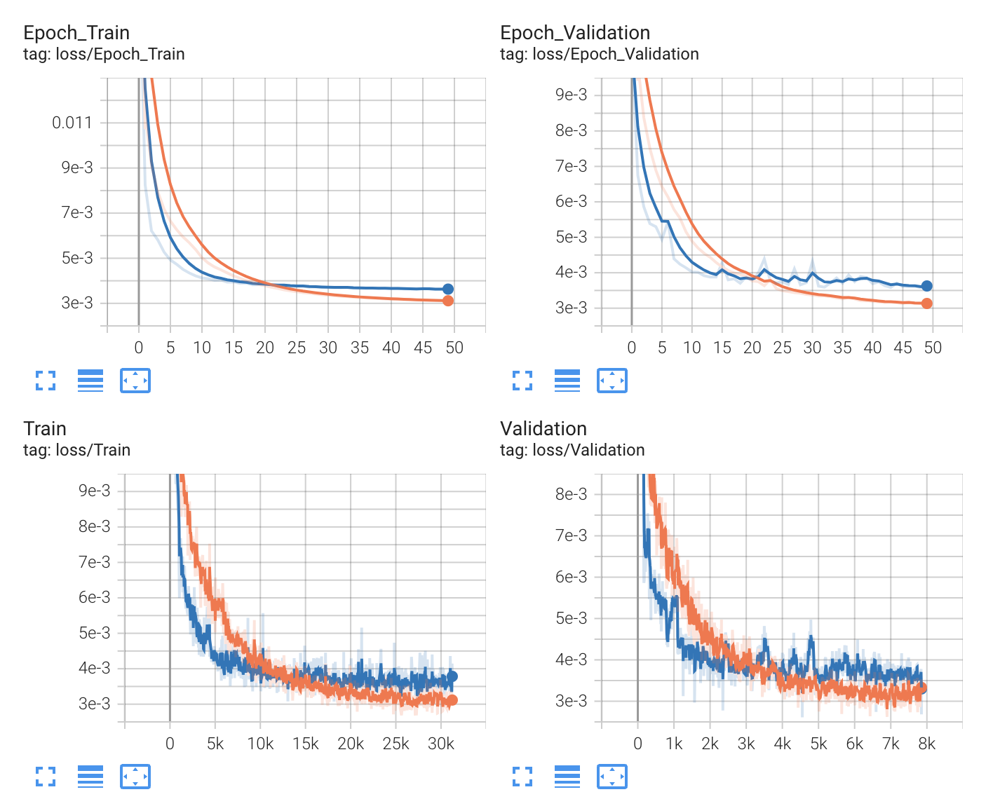
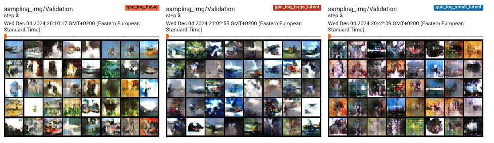

# Overview

This project involves implementing and training several generative models on the CIFAR-10 dataset. 
The models include AutoEncoders, Variational AutoEncoders (VAE), Generative Adversarial Network (GAN), and Normalizing Flow. 
A custom training pipeline has been developed to handle model training, validation, logging and saving best model.

It was a very long journey - **more than a week** of development, training models, testing, fixing, and this cycle several times. 
A lot of new things were learned, especially what should be taught in the Deep Learning course. 
A lot of time was also spent on creating a good model agnostic pipeline (more on that later).

## Dataset
### CIFAR-10
CIFAR-10 is a dataset of 60,000 32x32 color images in 10 classes, with 6,000 images per class. It is split into:

- Training set: 40,000 images
- Validation set: 10,000 images
- Test set: 10,000 images


## Training Pipeline
The pipeline was designed to:

- Load and preprocess CIFAR-10 data.
- Train and validate the models.
- Save the best checkpoint.
- Log training progress using TensorBoard.

The training pipeline was built on the basis of the well-known Pytorch Lightning, which brought both its advantages and disadvantages. The advantages include a good and convenient structure, similarity to a widely used technology. Among the disadvantages, one can highlight the fact that a lot of time was spent thinking through this pipeline, its components and behavior to make it truly model-agnostic for most tasks, and not just for this task.

## Metrics
Following metrics have been implemented: 

- **MSE (src.metrics.basic)** - measures the average squared difference between predicted and actual values and is commonly used for evaluating reconstruction quality;
- **BCE (src.metrics.basic)** - evaluates the difference between predicted and actual binary distributions and is often used for pixel-wise evaluations in generative tasks;
- **KLD (src.metrics.basic)** - evaluates how one probability distribution diverges from a target distribution and can measure how closely the latent space aligns with the prior distribution;
- **FID (src.metrics.fid)** - measures the similarity between distributions of real and generated images by comparing their feature embeddings using a pre-trained InceptionV3 model;
- **SSIM (src.metrics.ssim_loss)** - evaluates perceptual image quality by comparing the structural similarity between two images. It focuses on luminance, contrast, and structural fidelity;
- **IS (src.metrics.is)** - measures the quality and diversity of generated samples using a pre-trained classifier

A comparison of my own implementation of metrics and losses with the built-in implementations in Python packages can be found in the Jupyter Notebook named **playground-metrics.ipynb**. You can see that my own implementation of losses is completely consistent with the built-in functions, but more complex metrics have a larger difference. In my opinion, this is due to the possible more complex logic for ensuring computational stability, the use of other feature-extractors, and so on.

---

# Models
## AE
### Architecture
There were many attempts to build a good AE architecture, both on CIFAR10 and on MNIST. As a result, a convolutional model was chosen, which was then supposed to become the basis for VAE (but something went wrong).


### Losses and metrics
The model was trained with different hyperparameters - learning rate (5-e04 - orange and 1e-02 - blue). From the plots (both loss and SSIM) we can see that a higher learning rate has a steeper descent at the beginning, but achieves worse results. This is obvious, because learning rate is always a tradeoff between learning speed and accuracy.




### Reconstructions

The reconstructions show that with a large learning rate, the results are initially noticeably better (even though we are comparing epochs 1 and 2), but then the difference becomes less noticeable and at epoch 50 it is difficult to say which model is really better.

Epoch 0-1: 

Epoch 18-20:

Epoch 49:


### References
The AutoEncoder has been developed utilizing pure knowledge, ChatGPT and https://github.com/AlexPasqua/Autoencoders

---

## VAE
### Architecture
It took a lot of time to create a good VAE architecture, because as it turned out, it requires more detailed planning than AE. It was also decided to build a convolutional model. Several models with different latent space sizes (10, 128, 512 and 2048) were created and trained - more on this later.


### Losses and metrics
As we can see from the plots, the results for fairly large latent spaces are almost indistinguishable (however, with increasing latent space the results are always slightly better). The worst result is for a small latent space (10).

It can also be seen that the larger the latent space, the longer the training takes, although again the difference is not very large).

The plots for loss and BCE are very similar, because for stable training of the BCE model gives a greater impact than KLD. Also, SSIM plot similar to them.


From the following plots, it can be seen that KLD constantly rises slightly at first, and then gradually falls. This is due to the step-by-step training of the model and adaptation to the distribution. It can be seen that the larger the latent space, the larger the KLD and the more it increases at the beginning.


### Reconstructions
From the presented reconstructions, we can see that at each step the results of the model with a small latent space are the worst. This indicates that this dimension is not enough to study the variation well. The results of the other models become gradually better, although it is difficult to notice a noticeable difference between the 49th epoch and the 99th.

Overall, the reconstruction is more blurred than in AE, because we reparametrize the latent vector into a Gaussian distribution.

Epoch 3: 

Epoch 49:

Epoch 99:


### Generation
The generation of new pictures is much worse than I expected. I initially conducted research on MNIST (for simplicity and convenience) and they showed much better generation results. Unfortunately, the results did not hold, because I did not expect that CIFAR10 would be much worse.

In general, this can be explained by the large variability of pictures within one class, because in MNIST it is much smaller.

From the sample of epochs 3-49-99 we clearly see 2 things:
1. In the model with a small latent space, there is almost no improvement during training - the pictures remain the same. There are certain contours that are not very clear.
2. The results of larger spaces are more and more similar to color noise. This is probably due to the large variability and low dimensionality.
3. The larger the space, the duller the pictures.

Epoch 3: 

Epoch 49:

Epoch 99:


### References
Inspiration for the Variational AutoEncoder has been taken from the corresponding paper. Also following GitHub repos have been used:
- https://github.com/SashaMalysheva/Pytorch-VAE
- https://github.com/chaitanya100100/VAE-for-Image-Generation/tree/master/images
- https://github.com/AntixK/PyTorch-VAE/blob/master/models/cvae.py

## GAN
### Architecture
Again, the Deep Convolutional architecture was chosen to implement the GAN. The model consists of a Generator and a Discriminator, which learn together. The Generator's task is to learn to generate images that are as similar to the real ones as possible. The Discriminator's task is to learn to distinguish the generated images from the real ones as well as possible.

A model with three latent space sizes of 10, 100, and 2000 was trained to demonstrate the impact.


```
Generator(
  (net): Sequential(
    (0): ConvTranspose2d(100, 512, kernel_size=(4, 4), stride=(1, 1), bias=False)
    (1): BatchNorm2d(512, eps=1e-05, momentum=0.1, affine=True, track_running_stats=True)
    (2): ReLU(inplace=True)
    (3): ConvTranspose2d(512, 256, kernel_size=(4, 4), stride=(2, 2), padding=(1, 1), bias=False)
    (4): BatchNorm2d(256, eps=1e-05, momentum=0.1, affine=True, track_running_stats=True)
    (5): ReLU(inplace=True)
    (6): ConvTranspose2d(256, 128, kernel_size=(4, 4), stride=(2, 2), padding=(1, 1), bias=False)
    (7): BatchNorm2d(128, eps=1e-05, momentum=0.1, affine=True, track_running_stats=True)
    (8): ReLU(inplace=True)
    (9): ConvTranspose2d(128, 64, kernel_size=(4, 4), stride=(2, 2), padding=(1, 1), bias=False)
    (10): BatchNorm2d(64, eps=1e-05, momentum=0.1, affine=True, track_running_stats=True)
    (11): ReLU(inplace=True)
    (12): ConvTranspose2d(64, 3, kernel_size=(1, 1), stride=(1, 1), bias=False)
    (13): Sigmoid()
  )
)

Discriminator(
  (net): Sequential(
    (0): Conv2d(3, 64, kernel_size=(4, 4), stride=(2, 2), padding=(1, 1), bias=False)
    (1): LeakyReLU(negative_slope=0.2, inplace=True)
    (2): Conv2d(64, 128, kernel_size=(4, 4), stride=(2, 2), padding=(1, 1), bias=False)
    (3): BatchNorm2d(128, eps=1e-05, momentum=0.1, affine=True, track_running_stats=True)
    (4): LeakyReLU(negative_slope=0.2, inplace=True)
    (5): Conv2d(128, 256, kernel_size=(4, 4), stride=(2, 2), padding=(1, 1), bias=False)
    (6): BatchNorm2d(256, eps=1e-05, momentum=0.1, affine=True, track_running_stats=True)
    (7): LeakyReLU(negative_slope=0.2, inplace=True)
    (8): Conv2d(256, 512, kernel_size=(4, 4), stride=(2, 2), padding=(1, 1), bias=False)
    (9): BatchNorm2d(512, eps=1e-05, momentum=0.1, affine=True, track_running_stats=True)
    (10): LeakyReLU(negative_slope=0.2, inplace=True)
    (11): Conv2d(512, 1, kernel_size=(2, 2), stride=(2, 2), bias=False)
    (12): Sigmoid()
  )
)
```

### Losses and metrics
From the generator and discriminator loss plots, we clearly see that the discriminator learns significantly faster than the generator for all types of models. This is a common problem in GAN architectures when one of its components turns out to be too strong.

Interestingly, the loss rafts do not depend much on the dimensionality of the latent space.


It can be seen that the generator losses are dominant in the total losses, but it still learns worse.


SSIM is stable in the range of 0.77-0.78 (for comparison, for the best VAE models, this metric was 0.22). This metric is not usually used in GANs, but it is useful for comparing the GAN with other models.


### Generations
Despite the plots above, the image generation is surprisingly good and visually much better than in VAE. Here the difference between 3 and 49 epochs, as well as between 49 and 99, is clearly visible. However, as it turned out, the size of the latent space does not really affect the result.




### References
- The GAN paper
- https://github.com/csinva/gan-vae-pretrained-pytorch/blob/master/cifar10_dcgan/dcgan.py


## RealNVP
### Architecture
RealNVP is a flow-based generative model consisting of reversible coupling layers that split the input data into two parts: one is transformed using the learned scale and translation network, and the other is left unchanged. It alternates masking patterns between layers to ensure that all input dimensions are transformed. The model is trained by maximizing the likelihood of the data.

```
RealNVP(
  (layers): ModuleList(
    (0-3): 8 x CouplingLayer(
      (scale_net): ScaleTranslateNet(
        (net): Sequential(
          (0): Conv2d(3, 64, kernel_size=(3, 3), stride=(1, 1), padding=(1, 1))
          (1): ReLU()
          (2): Conv2d(64, 64, kernel_size=(3, 3), stride=(1, 1), padding=(1, 1))
          (3): ReLU()
          (4): Conv2d(64, 3, kernel_size=(3, 3), stride=(1, 1), padding=(1, 1))
        )
      )
      (translate_net): ScaleTranslateNet(
        (net): Sequential(
          (0): Conv2d(3, 64, kernel_size=(3, 3), stride=(1, 1), padding=(1, 1))
          (1): ReLU()
          (2): Conv2d(64, 64, kernel_size=(3, 3), stride=(1, 1), padding=(1, 1))
          (3): ReLU()
          (4): Conv2d(64, 3, kernel_size=(3, 3), stride=(1, 1), padding=(1, 1))
        )
      )
    )
  )
)
```

### Generation
This is the best I could get from the generation. Unfortunately, the loss was unstable and did not decrease. There are probably some problems in the model architecture.


### References
- A lot of videos about Normalization Flow
- A lot of repos with Normalization Flow
- Stress resistance