# Homework Report: Diffusion Models and Rectified Flow

## Overview

This project explores advanced generative modeling techniques based on diffusion processes. The primary goal is to implement and train several variants of diffusion models on the MNIST dataset. The work is divided into four main tasks:

- **Task 1:** Implement and train an unconditional diffusion model using Denoising Diffusion Probabilistic Models (DDPM) with inference via Denoising Diffusion Implicit Models (DDIM) in a pixel-based setting.
- **Task 2:** Integrate a Variational Autoencoder (VAE) from previous work with the diffusion model to construct a latent diffusion model. This task involves comparing DDPM and DDIM inference in the latent space.
- **Task 3:** Enhance the diffusion model with classifier-free guidance by conditioning the U-Net on class labels through an additional input channel and incorporating cross-attention mechanisms.
- **Task 4:** Implement and train diffusion models using Rectified Flow in both pixel and latent domains, aiming to improve training stability and image quality.

Each task builds on prior work and introduces new techniques to address the challenges of image generation and conditioning.

## Project Structure

The project is organized into a modular directory structure, ensuring code reusability and clarity:

```
.
├── models
│   └── weights                   # Saved model weights for various experiments
├── src
│   ├── models
│   │   ├── unet.py               # U-Net architecture for diffusion processes
│   │   └── vae.py                # Variational Autoencoder implementation
│   ├── components
│   │   ├── utils.py              # Utility functions and helpers
│   │   ├── process.py            # Data processing and augmentation routines
│   │   └── components.py         # Core diffusion and model components
│   └── modules
│       ├── latent_rectified_flow.py  # Implementation of latent Rectified Flow
│       ├── diffusion_model_cfg.py    # Configuration parameters for diffusion models
│       ├── diffusion_model.py        # Main diffusion model implementation (DDPM/DDIM)
│       ├── rectified_flow.py         # Rectified Flow algorithm implementation
│       ├── autoencoder.py            # Additional autoencoder utilities
│       └── latent_diffusion_model.py # Latent diffusion model implementation
├── task1.ipynb                   # Notebook for Task 1 experiments and results
├── task2.ipynb                   # Notebook for Task 2 experiments and results
├── task3.ipynb                   # Notebook for Task 3 experiments and results
├── task4.ipynb                   # Notebook for Task 4 (pixel-based) experiments and results
└── task4_latent.ipynb            # Notebook for Task 4 (latent-based) experiments and results

```

## Dataset

### MNIST

The MNIST dataset is a standard benchmark for image generation and classification tasks. It consists of 70,000 grayscale images of handwritten digits (0–9) with a resolution of 28x28 pixels. The dataset is divided into 60,000 training samples and 10,000 test samples, providing a diverse set of examples for both model training and evaluation. Its simplicity makes MNIST an ideal choice for developing and validating novel generative models.


## Training Pipeline

For this project, I opted to use [PyTorch Lightning](https://www.pytorchlightning.ai/) as the training framework. This decision was made to simplify the training loop and enhance code modularity compared to a custom-built pipeline. Lightning provides built-in features for logging, checkpointing, and GPU management, which accelerated the development and debugging process while ensuring scalability and reproducibility of the experiments.

## Tasks

### Task 1: Unconditional Diffusion Model (DDPM & DDIM)

- **Objective:**  

Implement and train an unconditional diffusion model using DDPM on the pixel level. Inference is performed using the DDIM approach to sample images more efficiently.

- **Implementation:**  

A U-Net architecture is used to model the denoising process. The DDPM framework gradually adds noise to the training images, while the reverse process (learned by the network) reconstructs the images from noise. DDIM is employed during inference to generate images with fewer sampling steps compared to DDPM.


```aiignore
       Input (1, H, W)
              │
     Initial Convolution
              │
      ┌─────────────────┐
      │   Down Block 0  │
      │ (Residual Blocks│
      │  → Downsample)  │
      └─────────────────┘
              │
      ┌─────────────────┐
      │   Down Block 1  │
      │ (Residual +     │
      │ Attention Blocks│
      │  → Downsample)  │
      └─────────────────┘
              │
      ┌─────────────────┐
      │    Mid Block 1  │
      │ (Residual Block)│
      └─────────────────┘
              │
      ┌─────────────────┐
      │   Mid Attention │
      │ (Self-Attention)│
      └─────────────────┘
              │
      ┌─────────────────┐
      │    Mid Block 2  │
      │ (Residual Block)│
      └─────────────────┘
              │
      ┌─────────────────┐
      │    Up Block 0   │
      │ (Upsample →     │
      │  Residual Blocks│
      │  + Attention)   │
      └─────────────────┘
              │
      ┌─────────────────┐
      │    Up Block 1   │
      │ (Upsample →     │
      │ Residual Blocks)│
      └─────────────────┘
              │
     Final Norm & SiLU
              │
     Final Convolution
              │
      Output (1, H, W)
```


- **Results:**  
The model has been trained with 40 epochs. Results are shown below:

The DDPM generation process takes 4s 422ms to generate 16 images.

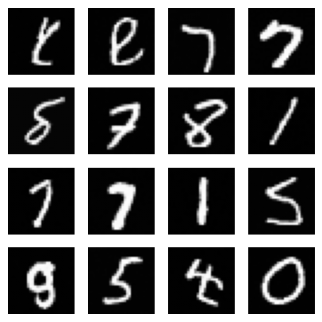

The DDIM generation process with 100 steps takes 569ms to generate 16 images.

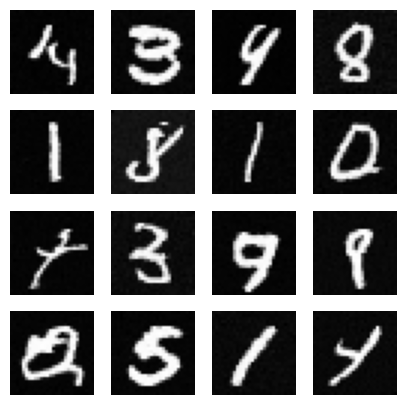

We can clearly see that although the process sped up, the quality of generated images is [almost] not affected.

---

### Task 2: Latent Diffusion Model

- **Objective:**  

Combine a pre-trained VAE (from previous homework) with the diffusion model to work in a compressed latent space. Compare the performance of DDPM and DDIM inference in the latent domain.

- **Implementation:**  

The VAE compresses MNIST images into a lower-dimensional latent representation. The diffusion model is then applied in this latent space, reducing computational overhead while maintaining image quality. Inference is conducted with both DDPM and DDIM to analyze the trade-offs between generation speed and quality.

```aiignore
            Input (1, H, W)
                    │
                    ▼
       ┌─────────────────────────┐
       │   Encoder:              │
       │ Conv2d(1, 16, 3x3, s=2) │
       │   → BatchNorm2d → ReLU  │
       │ Conv2d(16, 32, 3x3, s=2)│
       │   → BatchNorm2d → ReLU  │
       │ Conv2d(32, 64, 7x7, s=1)│
       │   → BatchNorm2d → ReLU  │
       └─────────────────────────┘
                    │
                    ▼
            Flatten to vector & 
         Compute fc_mu and fc_logvar
                    │
                    ▼
              Latent Vector (64)
                    │
                    ▼
               fc_decode (FC)
                    │
                    ▼
       ┌─────────────────────────┐
       │   Decoder:              │
       │ConvTranspse2d(64,32,7x7)│
       │  → BatchNorm2d → ReLU   │
       │ConvTranspse2d(32,16,3x3,│
       │   s=2, padding=1,       │
       │   output_padding=1)     │
       │   → BatchNorm2d → ReLU  │
       │ConvTranspose2d(16,1,3x3,│
       │   s=2, padding=1,       │
       │   output_padding=1)     │
       │    → Sigmoid            │
       └─────────────────────────┘
                    │
                    ▼
            Output (1, H, W)
```

- **Results:**  

The latent diffusion model generates images that are comparable in quality to the pixel-based approach while offering faster sampling and lower computational cost. Visualizations of the latent space and reconstructions further support the efficacy of this method.  
  
Below you can see an example of image encoding into 64d latent space and reconstruction.

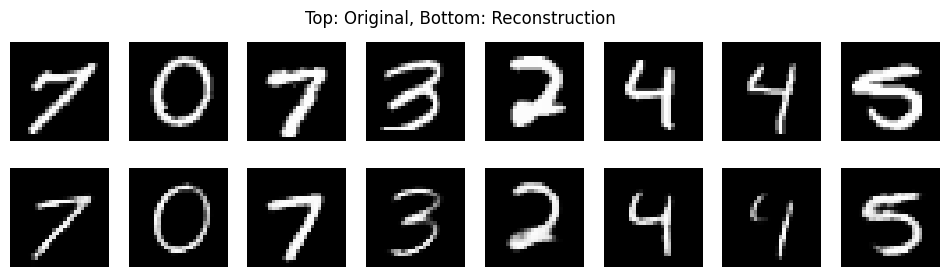

The idea of latent diffusion is to work with lower dimensional image representation rather than pixel representation. This approach speed up the training and generation process.

The UNet has been trained with 40 epochs.

The DDPM generation process takes 5s 677ms to generate 16 images.

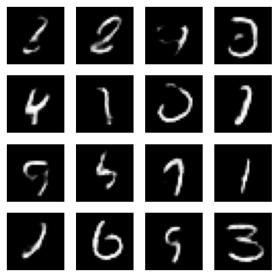

The DDIM generation process takes 695ms to generate 16 images.

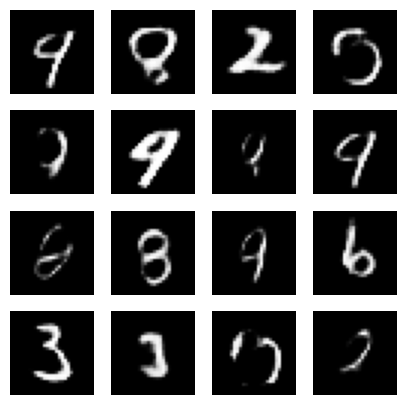


---

### Task 3: Classifier-Free Guidance with Class Labels

- **Objective:**  

Improve the diffusion model by incorporating classifier-free guidance. This involves conditioning the U-Net with class label information to steer the image generation process.

- **Implementation:**

Class labels are integrated into the U-Net architecture through an additional input channel. Cross-attention mechanisms are employed to allow the model to focus on the features corresponding to each digit class. This method enhances control over the generation process, enabling more precise synthesis of class-specific images.

```aiignore
              Input Image (1, H, W)
                      │
       ┌──────────────┴──────────────┐
       │                             │
       ▼                             ▼
Class Embedding (10 → 32)       Time Embedding
       │         (PosEmb → FC)         │
       └─────── Concatenation ────────┘
                     │  (33 channels)
                     ▼
              Initial Convolution
                     │
          ┌─────────────────────────┐
          │      Down Block 0       │
          │ (Residual Blocks +      │
          │   Downsampling)         │
          └─────────────────────────┘
                     │
          ┌─────────────────────────┐
          │      Down Block 1       │
          │ (Residual Blocks +      │
          │   Attention +           │
          │   Downsampling)         │
          └─────────────────────────┘
                     │
          ┌─────────────────────────┐
          │        Mid Blocks       │
          │ (Residual Blocks +      │
          │   Self-Attention)       │
          └─────────────────────────┘
                     │
          ┌─────────────────────────┐
          │  Cross-Attention Block  │
          │  (Integrates Class Info)│
          └─────────────────────────┘
                     │
          ┌─────────────────────────┐
          │      Up Block 0         │
          │ (Upsampling + Residual  │
          │   Blocks + Attention)   │
          └─────────────────────────┘
                     │
          ┌─────────────────────────┐
          │      Up Block 1         │
          │ (Upsampling + Residual  │
          │   Blocks)               │
          └─────────────────────────┘
                     │
             Final Norm & SiLU
                     │
              Final Convolution
                     │
             Output Image (1, H, W)

```


- **Results:**  

Experiments demonstrate that classifier-free guidance leads to enhanced image clarity and more distinct digit representations. Comparative results show a marked improvement over the unconditional model.  
 
The UNet with classifier-free guidance implemented by Cross Attention has been trained with 40 epochs.

The results of DDIM generation with 100 steps for 10 classes are shown below.

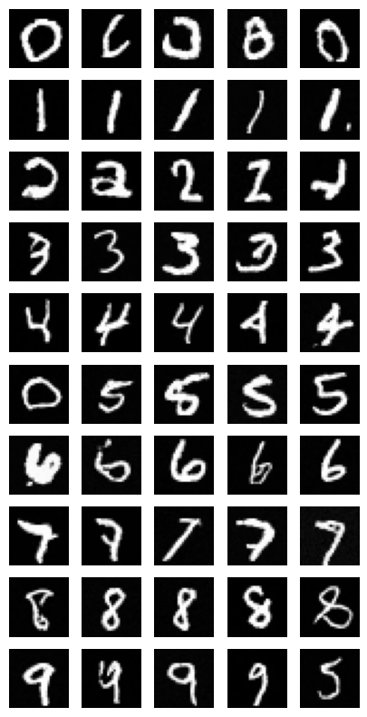
  

---

### Task 4: Diffusion Model Using Rectified Flow

- **Objective:**  

Implement and train diffusion models based on the Rectified Flow framework in both pixel and latent spaces. The goal is to improve the stability of the training process and achieve higher-quality image generation.

- **Implementation:**  

Rectified Flow is applied to rectify the diffusion process, smoothing the training dynamics and better capturing the underlying data distribution. This method is tested on both pixel-based and latent-based architectures, providing insights into its effectiveness across different domains.


Rectified Flow recasts the diffusion process as a continuous transformation by estimating the underlying velocity field that guides samples smoothly from noise to data. This velocity-based formulation reduces discretization errors, enhances training stability, and often leads to faster convergence and higher-quality generated images.

The training process was following: 
1. Creating and training a UNet model for rectified flow
2. Generating fixed noise-image pairs by this UNet
3. Making a re-flow of a new UNet model to kind of distill the knowledge to make the convergence faster.


- **Results:**  

The use of Rectified Flow results in a more stable training process and improved image quality. Early results indicate that the latent-based model benefits from faster convergence and smoother generation, while the pixel-based model shows notable improvements in sample fidelity.  

Rectified Flow results:

1 step: 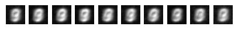

2 steps: 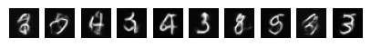

5 steps: 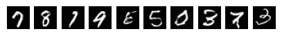

10 step: 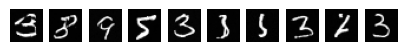

100 step: 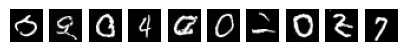

Rectified Flow with 1 reflow results:

1 step: 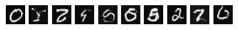

2 step: 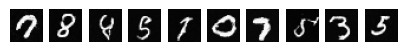

5 step: 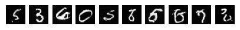

10 step: 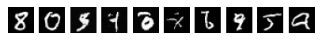


The models have been trained by only 10 epochs but we can clearly see that the model with one reflow returns the same image quality on the first step, as the model without on 5th.

Latent Rectified flow on 100 steps:

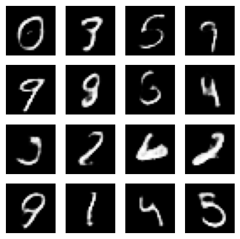

Latent Rectified flow with one Re-Flow on 10 steps:

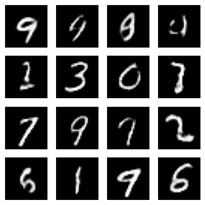

---

## References
- [DDPM from scratch in Pytorch](https://www.kaggle.com/code/vikramsandu/ddpm-from-scratch-in-pytorch/notebook)
- [GenAI course lecture about diffusion and rectified flow](https://youtu.be/ubxSoFfPTq0?list=PLr1w0qwTp9lCb10sOzlKZrmHNkoDHsntE&t=5245)
- [Rectified Flow paper](https://arxiv.org/abs/2209.03003)
- [Repo with implementation of rectified flow](https://github.com/minii-ai/smol-rectified-flow/tree/main)
---


